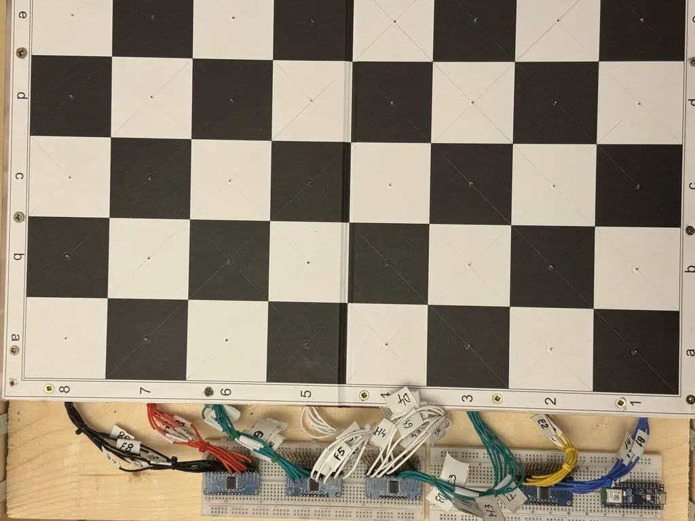
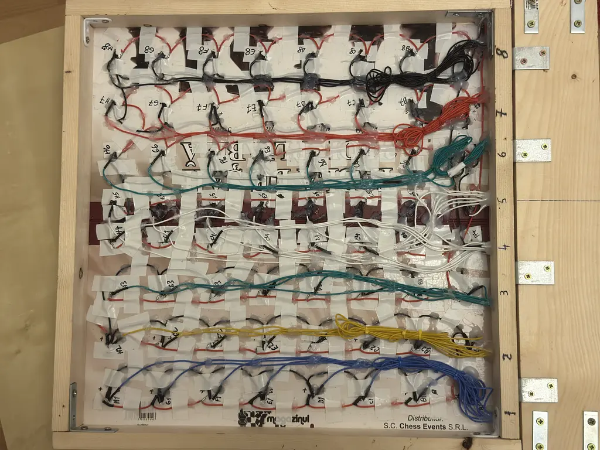
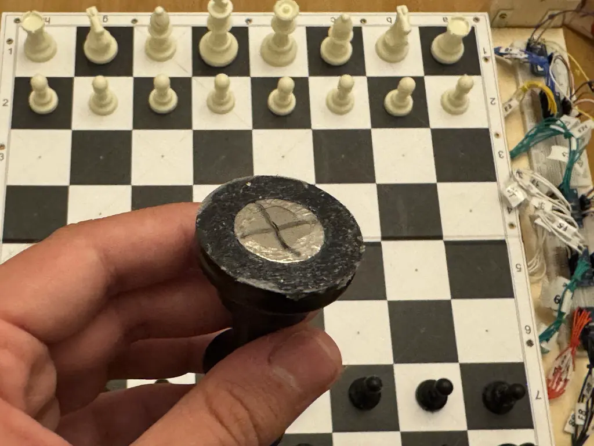
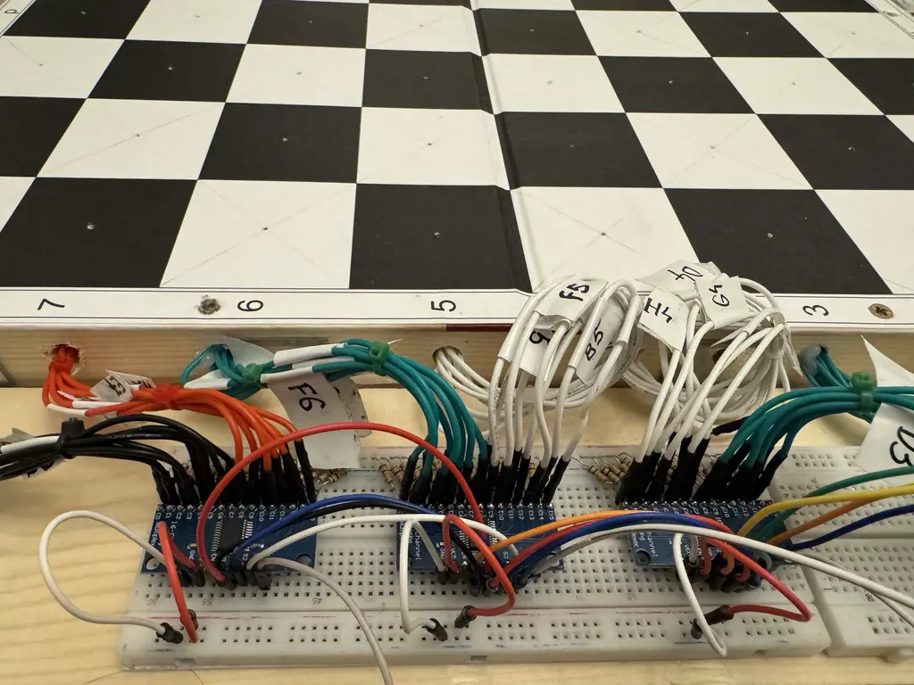

# Smart Chess Board - Bitboard Implementation Documentation


## Overview






This Rust embedded application implements a smart chess board using an ESP32 microcontroller with Hall effect sensors to detect piece movements. The core chess logic uses **bitboards** - a highly efficient data structure for representing chess positions using 64-bit integers.

## Table of Contents

1. [Bitboard Fundamentals](#bitboard-fundamentals)
2. [Chess Board Representation](#chess-board-representation)
3. [Bitboard Operations](#bitboard-operations)
4. [Hardware Integration](#hardware-integration)
5. [Move Detection System](#move-detection-system)
6. [BLE Communication](#ble-communication)

---

## Bitboard Fundamentals

### What is a Bitboard?

A **bitboard** is a 64-bit unsigned integer (`u64`) where each bit represents one square on the chess board. Since a chess board has exactly 64 squares (8×8), this creates a perfect one-to-one mapping.

### Square Mapping

The chess board squares are mapped to bit positions as follows:

```
Bit positions (chess squares):
63 62 61 60 59 58 57 56  → rank 8 (A8-H8)
55 54 53 52 51 50 49 48  → rank 7 (A7-H7)
47 46 45 44 43 42 41 40  → rank 6 (A6-H6)
39 38 37 36 35 34 33 32  → rank 5 (A5-H5)
31 30 29 28 27 26 25 24  → rank 4 (A4-H4)
23 22 21 20 19 18 17 16  → rank 3 (A3-H3)
15 14 13 12 11 10 9  8   → rank 2 (A2-H2)
7  6  5  4  3  2  1  0   → rank 1 (A1-H1)
```

**Key Point**: Bit 0 corresponds to square A1, bit 63 corresponds to square H8.

### Why Use Bitboards?

1. **Memory Efficiency**: 64 squares represented in just 8 bytes
2. **Fast Operations**: Bitwise operations are extremely fast
3. **Parallel Processing**: Can check multiple squares simultaneously
4. **Clean Logic**: Complex chess operations become simple bit manipulations

---

## Chess Board Representation

### ChessBoard Structure

The `ChessBoard` struct uses 12 separate bitboards - one for each piece type and color combination:

```rust
struct ChessBoard {
    // White pieces
    white_pawns: u64,
    white_knights: u64,
    white_bishops: u64,
    white_rooks: u64,
    white_queens: u64,
    white_king: u64,
    
    // Black pieces
    black_pawns: u64,
    black_knights: u64,
    black_bishops: u64,
    black_rooks: u64,
    black_queens: u64,
    black_king: u64,
}
```

### Initial Position Bitboards

The starting chess position is encoded using hexadecimal constants:

```rust
// Example: White pawns on rank 2
white_pawns: 0x000000000000FF00

// Converting to binary:
// 0x000000000000FF00 = 0000...0000 1111 1111 0000 0000
// This represents bits 8-15 set to 1 (rank 2)
```

**Detailed Example - White Pawns**:
```
Hexadecimal: 0x000000000000FF00
Binary:      0000 0000 0000 0000 0000 0000 0000 0000 0000 0000 0000 0000 1111 1111 0000 0000

Visual representation on board:
0 0 0 0 0 0 0 0  ← rank 8 (empty)
0 0 0 0 0 0 0 0  ← rank 7 (empty)
0 0 0 0 0 0 0 0  ← rank 6 (empty)
0 0 0 0 0 0 0 0  ← rank 5 (empty)
0 0 0 0 0 0 0 0  ← rank 4 (empty)
0 0 0 0 0 0 0 0  ← rank 3 (empty)
1 1 1 1 1 1 1 1  ← rank 2 (white pawns)
0 0 0 0 0 0 0 0  ← rank 1 (empty)
```

### Complete Starting Position

```rust
const fn new() -> Self {
    ChessBoard {
        white_pawns:   0x000000000000FF00,  // Rank 2 (squares 8-15)
        white_knights: 0x0000000000000042,  // B1, G1 (squares 1, 6)
        white_bishops: 0x0000000000000024,  // C1, F1 (squares 2, 5)
        white_rooks:   0x0000000000000081,  // A1, H1 (squares 0, 7)
        white_queens:  0x0000000000000010,  // D1 (square 3)
        white_king:    0x0000000000000008,  // E1 (square 4)
        
        black_pawns:   0x00FF000000000000,  // Rank 7 (squares 48-55)
        black_knights: 0x4200000000000000,  // B8, G8 (squares 57, 62)
        black_bishops: 0x2400000000000000,  // C8, F8 (squares 58, 61)
        black_rooks:   0x8100000000000000,  // A8, H8 (squares 56, 63)
        black_queens:  0x1000000000000000,  // D8 (square 59)
        black_king:    0x0800000000000000,  // E8 (square 60)
    }
}
```

---

## Bitboard Operations

### 1. Checking if a Square Contains a Piece

**Core Concept**: Use a bitmask to isolate a specific square.

```rust
fn get_piece_at(&self, square: u8) -> Option<Piece> {
    // Create mask with only the target square bit set
    let mask = 1u64 << square;
    
    // Check each piece bitboard using bitwise AND
    if self.white_pawns & mask != 0 { 
        return Some(Piece { piece_type: PieceType::Pawn, color: Color::White }); 
    }
    // ... check all other piece types
}
```

**Example**: Checking square E2 (square 12)
```
square = 12
mask = 1u64 << 12 = 0x0000000000001000

white_pawns = 0x000000000000FF00
mask        = 0x0000000000001000
AND result  = 0x0000000000001000 ≠ 0  ✓ White pawn found!
```

### 2. Placing a Piece

**Core Concept**: Use bitwise OR to set a bit to 1.

```rust
fn place_piece(&mut self, square: u8, piece: Piece) {
    let mask = 1u64 << square;
    match (piece.color, piece.piece_type) {
        (Color::White, PieceType::Pawn) => self.white_pawns |= mask,
        // ... other piece types
    }
}
```

**Example**: Placing white pawn on E4 (square 28)
```
Before: white_pawns = 0x000000000000FF00
mask = 1u64 << 28    = 0x0000000010000000
After:  white_pawns  = 0x0000000010000FF00 (OR operation sets bit 28)
```

### 3. Removing a Piece

**Core Concept**: Use bitwise AND with inverted mask to clear a bit.

```rust
fn remove_piece(&mut self, square: u8) {
    let mask = !(1u64 << square);  // Invert mask: all bits 1 except target
    self.white_pawns &= mask;      // Clear bit if set
    self.white_knights &= mask;
    // ... clear from all bitboards
}
```

**Example**: Removing piece from E2 (square 12)
```
mask = !(1u64 << 12) = !0x0000000000001000 = 0xFFFFFFFFFFFFEFFF

Before: white_pawns = 0x000000000000FF00
AND with mask:        0xFFFFFFFFFFFFEFFF
After:  white_pawns = 0x000000000000EF00 (bit 12 cleared)
```

### 4. Move Execution

```rust
fn execute_move(&mut self, from: u8, to: u8, piece: Piece, captured_piece: Option<Piece>) {
    self.remove_piece(from);        // Clear source square
    if captured_piece.is_some() {
        self.remove_piece(to);      // Clear captured piece
    }
    self.place_piece(to, piece);    // Place piece at destination
}
```

---

## Hardware Integration

### Multiplexer Control System

The chess board uses CD74HC4067 multiplexers to read 64 Hall effect sensors with minimal GPIO pins:

- **4 control pins** (S0-S3): Select which of 16 channels to read
- **4 signal pins**: Read from 4 different multiplexers
- **Total coverage**: 4 × 16 = 64 squares

### Square Index Mapping

```rust
fn get_square_index(signal_pin: u8, channel: usize) -> Option<u8> {
    let square_idx = match signal_pin {
        1 => { // Rows 8 and 7
            if channel < 8 { 56 + channel }      // Row 8: squares 56-63
            else if channel < 16 { 48 + (channel - 8) } // Row 7: squares 48-55
            else { return None; }
        },
        2 => { // Rows 6 and 5
            if channel < 8 { 40 + channel }      // Row 6: squares 40-47
            else if channel < 16 { 32 + (channel - 8) } // Row 5: squares 32-39
            else { return None; }
        },
        // ... similar for pins 3 and 4
    };
    Some(square_idx as u8)
}
```

### Sensor Reading Loop

```rust
// Iterate through all 16 multiplexer channels
for channel in 0..16 {
    // Set multiplexer control pins
    s0.set_level(if MUX_CHANNELS[channel][0] == 1 { Level::High } else { Level::Low });
    s1.set_level(if MUX_CHANNELS[channel][1] == 1 { Level::High } else { Level::Low });
    s2.set_level(if MUX_CHANNELS[channel][2] == 1 { Level::High } else { Level::Low });
    s3.set_level(if MUX_CHANNELS[channel][3] == 1 { Level::High } else { Level::Low });
    
    // Read from all 4 signal pins simultaneously
    let readings = [
        sig_pin_1.is_high(),
        sig_pin_2.is_high(),
        sig_pin_3.is_high(),
        sig_pin_4.is_high(),
    ];
    
    // Process readings and update chess board state
}
```

---

## Move Detection System

### State Filtering

To prevent false readings from electromagnetic interference, the system implements a **5-reading confirmation system**:

```rust
struct SquareState {
    confirmed_state: bool,      // Current confirmed state
    consecutive_count: u8,      // Count of identical readings
    last_reading: bool,         // Most recent sensor reading
}

fn update(&mut self, new_reading: bool) -> bool {
    if new_reading == self.last_reading {
        if self.consecutive_count < 255 {
            self.consecutive_count += 1;
        }
    } else {
        self.consecutive_count = 1;
        self.last_reading = new_reading;
    }

    // Require 5 consecutive identical readings to confirm change
    if self.consecutive_count >= 5 && new_reading != self.confirmed_state {
        self.confirmed_state = new_reading;
        return true; // State change confirmed
    }
    false
}
```

### Move State Machine

The `MoveTracker` implements a finite state machine to handle different phases of a chess move:

```rust
enum GameState {
    WaitingForMove,        // Ready for player to lift a piece
    PieceLifted,          // Piece lifted, waiting for placement
    WaitingForCapture,    // Capture detected, waiting for placement
    WaitingForPlacement,  // Ready for piece to be placed
    WaitingForPromotion,  // Pawn promotion in progress
    OpponentTurn,         // Other player's turn
}
```

### Move Processing Logic

1. **Piece Lifted**: Sensor changes from `false` → `true`
   - Check if piece belongs to current player
   - Update bitboard by removing piece
   - Store move context in tracker

2. **Piece Placed**: Sensor changes from `true` → `false`
   - Validate placement location
   - Check for captures, promotions, etc.
   - Update bitboard with new piece position
   - Switch turns

3. **Capture Detection**: 
   - If opponent's piece lifted during move, mark as capture
   - Implement timeout to prevent game stalls

---

## BLE Communication

### Channel-Based Architecture

The system uses Embassy async channels for communication between tasks:

```rust
// Global communication channels
static BLE_COMMAND_CHANNEL: Channel<CriticalSectionRawMutex, BleCommand, 10> = Channel::new();
static BLE_EVENT_CHANNEL: Channel<CriticalSectionRawMutex, BleEvent, 10> = Channel::new();

// Command types
enum BleCommand {
    SendData(heapless::Vec<u8, 256>),
    UpdateCharacteristic(u8, heapless::Vec<u8, 256>),
}

// Event types  
enum BleEvent {
    DataReceived(heapless::Vec<u8, 256>),
    ClientConnected,
    ClientDisconnected,
    CharacteristicWritten(u8, heapless::Vec<u8, 256>),
}
```

### GATT Service Implementation

The BLE service provides multiple characteristics for different types of data:

```rust
gatt!([service {
    uuid: "937312e0-2354-11eb-9f10-fbc30a62cf38",
    characteristics: [
        characteristic {
            uuid: "937312e0-2354-11eb-9f10-fbc30a62cf38",
            read: rf,   // Read move data
            write: wf,  // Receive commands
        },
        characteristic {
            uuid: "957312e0-2354-11eb-9f10-fbc30a62cf38", 
            write: wf2, // Alternative command channel
        },
        characteristic {
            name: "my_characteristic",
            uuid: "987312e0-2354-11eb-9f10-fbc30a62cf38",
            notify: true,  // Push notifications
            read: rf3,
            write: wf3,
        },
    ],
}]);
```

---

## Key Advantages of Bitboard Implementation

### 1. **Performance**
- Bitwise operations execute in single CPU cycles
- Parallel processing of multiple squares
- Minimal memory footprint (96 bytes total for all pieces)

### 2. **Elegance**
- Complex chess logic becomes simple bit manipulations
- Easy to implement attack/defense patterns
- Natural representation for chess algorithms

### 3. **Scalability**
- Easy to add new piece types or game variants
- Efficient for AI evaluation functions
- Supports advanced chess programming techniques

### 4. **Hardware Integration**
- Direct mapping between physical sensors and bit positions
- Efficient sensor state management
- Real-time move validation

---

## Future Enhancements

### Potential Bitboard Extensions

1. **Attack Bitboards**: Pre-compute piece attack patterns
2. **Occupancy Bitboards**: Combine all pieces for collision detection
3. **Move Generation**: Use bitboards for legal move calculation
4. **Position Evaluation**: Implement positional scoring using bitboards

### Example - Attack Bitboards
```rust
impl ChessBoard {
    fn get_white_attacks(&self) -> u64 {
        let mut attacks = 0u64;
        
        // Pawn attacks (example for white pawns)
        attacks |= (self.white_pawns << 7) & 0xFEFEFEFEFEFEFEFE; // Left attacks
        attacks |= (self.white_pawns << 9) & 0x7F7F7F7F7F7F7F7F; // Right attacks
        
        // Add knight, bishop, rook, queen, king attacks...
        
        attacks
    }
}
```

This bitboard-based chess implementation provides a solid foundation for advanced chess programming while efficiently interfacing with embedded hardware for real-time piece detection and move validation.
